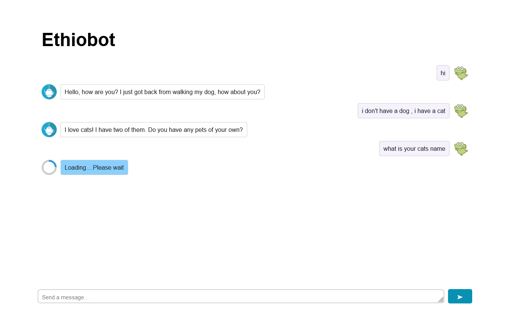

# Ethiobot-with-flask

# Steps

- clone the repository: 'git clone https://github.com/BlackLionXD/Ethiobot-with-flask.git'
- create a virtual environment: 'python -m venv your_env_name'
- install the required files: 'pip install -r requirements.txt'
- run the project: 'python main.py'

# Screenshot

